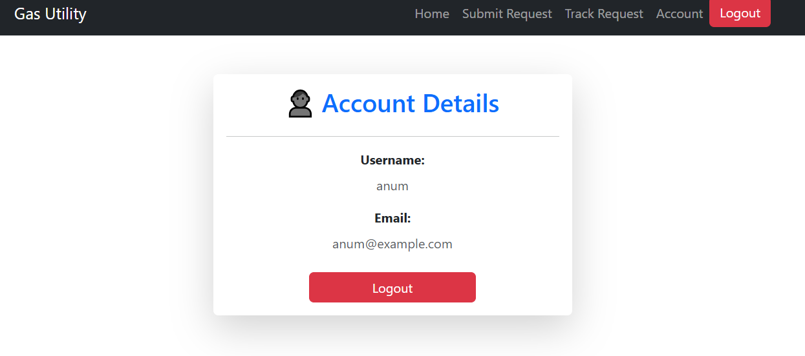
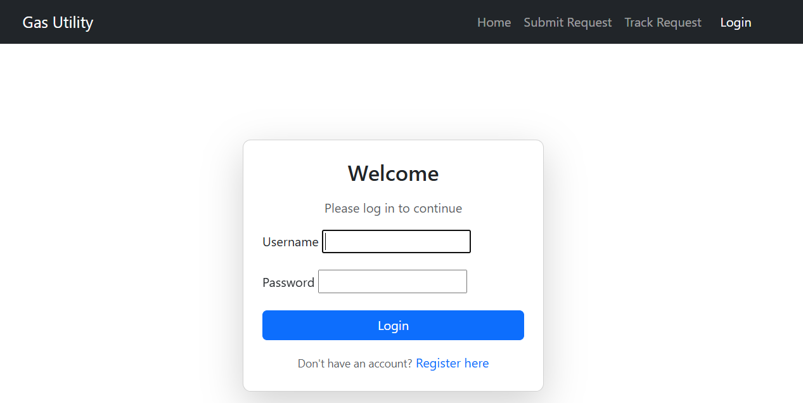
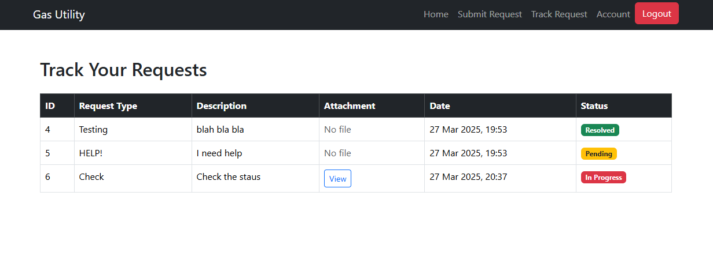

# Gas Utility Consumer Services  

A **Django-based web application** for managing gas utility service requests. This project allows consumers to **submit service requests**, **track their progress**, and enables staff members to **manage and update request statuses**.  

## Table of Contents  

- [Overview](#overview)  
- [Features](#features)  
- [Tech Stack](#tech-stack)  
- [Installation & Setup](#installation--setup)  
- [Running the Project](#running-the-project)  
- [Usage Guide](#usage-guide)  
- [Screenshots](#screenshots)  
- [License](#license)  
- [Contact](#contact)  

---

## Overview  

This application streamlines the process of **service request management** for gas utility consumers. Users can:  
- **Submit service requests** with details and attachments.  
- **Track request status** in real-time.  
- **Staff members** can manage, update, and process service requests.  

The UI is designed with **Bootstrap** to provide a modern, responsive experience.  

---

## Features  

- User authentication (Login & Logout)   
- Submit service requests with file attachments  
- Track requests and view their status  
- Staff dashboard to **manage and update** requests  
- Admin panel for complete management  
- Responsive **Bootstrap-based UI**  

---

## Tech Stack  

- **Frontend:** HTML, CSS, Bootstrap  
- **Backend:** Django (Python)  
- **Database:** SQLite  
- **Version Control:** Git & GitHub  

---


## Installation & Setup  

### 1. Clone the Repository  

```bash
git clone https://github.com/YOUR_GITHUB_USERNAME/Gas-Utility.git
cd Gas-Utility
```

### 2. Create and Activate a Virtual Environment  

For **Windows**:  

```bash
python -m venv venv
venv\Scripts\activate
```

For **Mac/Linux**:  

```bash
python3 -m venv venv
source venv/bin/activate
```

### 3. Install Dependencies  

```bash
pip install -r requirements.txt
```

### 4. Run Migrations  

```bash
python manage.py migrate
```

### 5. Create a Superuser (for admin and staff access)  

```bash
python manage.py createsuperuser
```

Follow the prompts to create a **username, email, and password**.

### 6. Run the Development Server  

```bash
python manage.py runserver
```

Now open your browser and visit:  
- **User Dashboard:** [http://127.0.0.1:8000/](http://127.0.0.1:8000/)  
- **Admin Panel:** [http://127.0.0.1:8000/admin](http://127.0.0.1:8000/admin)  


## Screenshots

### Home Page


### Submit Request Page


### Track Request Page

